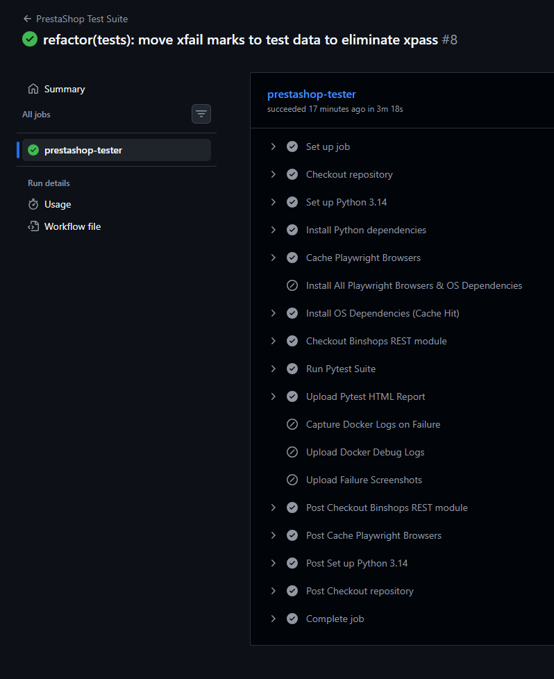
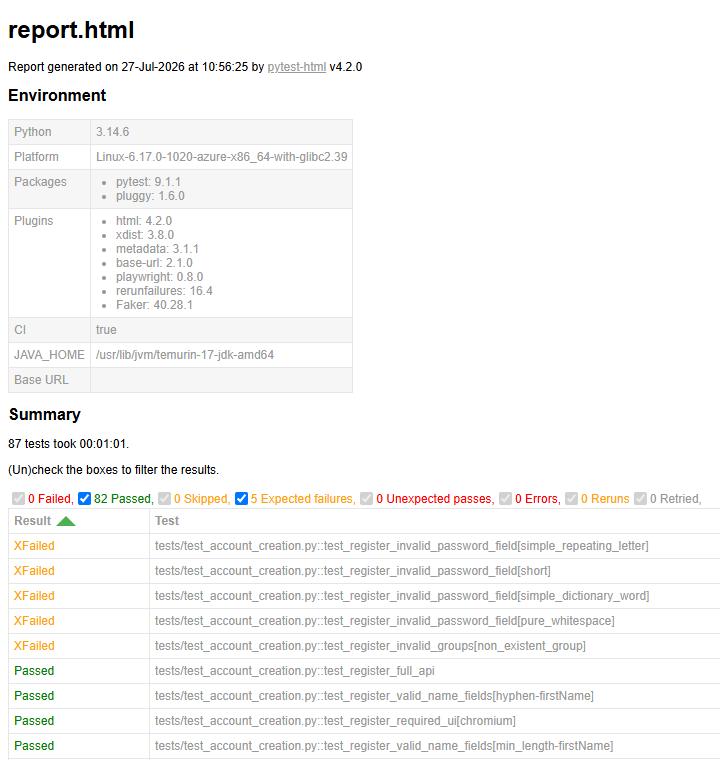

# 🛒 PrestaShop QA Automation Suite (`prestashop-qa`)

[ English ] | [ [Русский](README_RU.md) ]

[](https://github.com/ruvild/prestashop-qa/actions/workflows/prestashop.yaml)

A containerized testing framework for **PrestaShop** (with the additional **Binshops** module for extra API features), combining **UI, API, and end-to-end testing**. Built with Python, Pytest, Playwright, and Docker Compose to support both local development and multi-browser execution in GitHub Actions CI/CD pipelines. The test environment is provisioned automatically, allowing both local execution and GitHub Actions to run the same setup workflow.

---

## 💻 Tech Stack

- Python
- Pytest
- Playwright
- Requests
- Pydantic
- Docker & Docker Compose
- GitHub Actions
- PrestaShop 9
---

## 🚧 Test Suite Progress & Roadmap

- 🟩 **Account Creation Flow** — *Completed (UI & API)*
- 🟩 **Authentication / Login** — *Completed (Hybrid UI/API)*
- 🚧 **Main / Home Page Navigation** — *In Progress / Planned*
- 🚧 **Product Browsing & Search** — *In Progress / Planned*
- 🚧 **Full Checkout Flow** — *In Progress / Planned*

---

## 🏗️ Architecture & Key Features

* **Isolated Container Environment:** Spins up local PrestaShop and MySQL containers automatically via `compose.yaml`.
* **Hybrid Testing Strategy:** Blends fast API setup/teardown validations (using Pydantic models/schemas) with deep UI automation using the Page Object Model (POM).
* **Parallel Execution & Cross-Browser:** Built to run tests across Chromium, Firefox, and WebKit simultaneously via `pytest-xdist`.
* **Automated CI/CD:** GitHub Actions pipeline features intelligent caching for Playwright dependencies and automatic artifact capture (failure screenshots, server logs, and HTML reports). The test suite runs automatically on every push or pull request via GitHub Actions.



*Figure 1: Automated multi-browser execution and artifact collection in GitHub Actions.*

---

## 📂 Repository Structure

```text
prestashop-qa/
├── .github/workflows/
│   └── prestashop.yaml         # GitHub Actions CI/CD pipeline definition
├── clients/                    # API clients and HTTP session wrappers
├── config/                     # Helper utilities, constants, and API permission matrices
├── docs/assets/                # README Images
├── factories/                  # Test data generators
├── models/                     # Data models for UI form inputs
├── pages/                      # Page Object Model (POM) representations
├── schemas/                    # Pydantic contract schemas for API response validation
├── scripts/                    # Environment provisioning & API client initialization scripts
├── tests/                      # UI & API test modules, test data, and scoped fixtures
├── .gitignore                  # Git tracking rules
├── compose.yaml                # PrestaShop & MySQL container orchestration
├── conftest.py                 # Global Pytest fixtures, CI auto-provisioning, and OAuth tokens
├── pytest.ini                  # Pytest flags, HTML reporting configs, and execution rules
└── requirements.txt            # Python dependencies
```
# 🛠️ Prerequisites & Setup

## Requirements

- Python **3.14** (or **3.11+**)
- Docker Engine **29.0+**
- Docker Compose **v5.0+**

## 1. Installation

Clone the repository and install the dependencies:

```bash
git clone https://github.com/ruvild/prestashop-qa.git
cd prestashop-qa

pip install -r requirements.txt
```

## 2. Environment Provisioning

The framework includes an automated setup script that:

- Starts the Docker containers.
- Waits for PrestaShop to initialize.
- Automatically disables HTTPS/TLS enforcement on the Admin API for debug-mode testing.

To provision the environment locally, create a small helper script:

```python
from scripts.setup_environment import ensure_environment

if __name__ == "__main__":
    ensure_environment()
```

Save it as `local_env_setup.py`, then execute:

```bash
python local_env_setup.py
```

> **Note:** In CI environments, `conftest.py` automatically detects `CI=true` and runs `ensure_environment()` during `pytest_configure()`, so no manual setup is required.

---

# 🧪 Running Tests

Once the environment is ready, execute the test suite using standard `pytest` commands.

## Standard Local Execution

```bash
pytest
```

## Parallel Execution

```bash
pytest -n auto
```

## Run Tests in a Specific Browser

```bash
pytest --browser chromium
```

## HTML Test Reports

HTML reports are generated automatically in:

```text
reports/report.html
```

as configured in `pytest.ini`.



*Figure 2: Standalone HTML execution report showing pass/fail metrics and execution timing.*

---

# 🐛 Discovered & Reported Defects

During development, several defects were identified and reported to the official [PrestaShop](https://github.com/PrestaShop/PrestaShop) and [Binshops Plugin](https://github.com/binshops/prestashop-rest) repositories. The corresponding tests are retained in this project as regression tests using `pytest.mark.xfail` where appropriate.

* 🐛 [#42129](https://github.com/PrestaShop/PrestaShop/issues/42129) — Disparity between UI and API password rules
* 🐛 [#42130](https://github.com/PrestaShop/PrestaShop/issues/42130) — Possible to create a customer with a non-existent group
* 🐛 [#42131](https://github.com/PrestaShop/PrestaShop/issues/42131) — Inconsistent key casing between payloads
* 🐛 [#42132](https://github.com/PrestaShop/PrestaShop/issues/42132) — Inconsistent whitespace Sanitization
* 🐛 [#42133](https://github.com/PrestaShop/PrestaShop/issues/42133) — Registration Page name fields descriptions are missing hyphen as an allowed character
* 🐛 [#55](https://github.com/binshops/prestashop-rest/issues/55) — Login endpoint crashes in PrestaShop 9.2.0

> 🔗 **View All Submitted Reports:** [PrestaShop Issue Tracker](https://github.com/PrestaShop/PrestaShop/issues?q=is%3Aissue+author%3Aruvild)